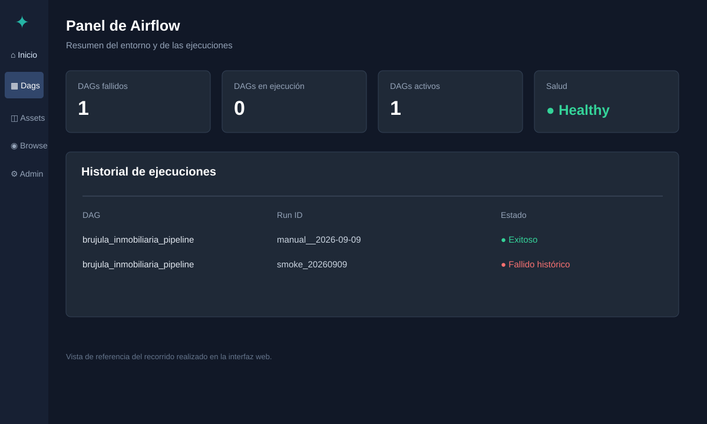
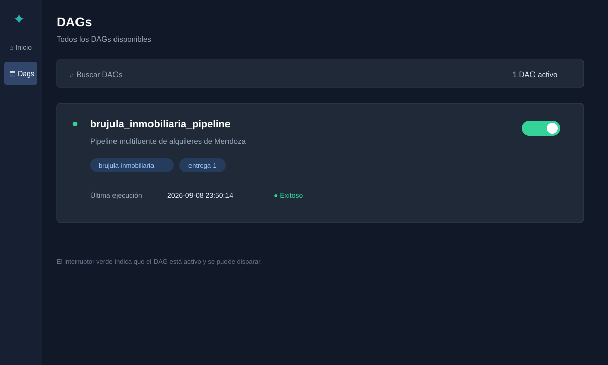
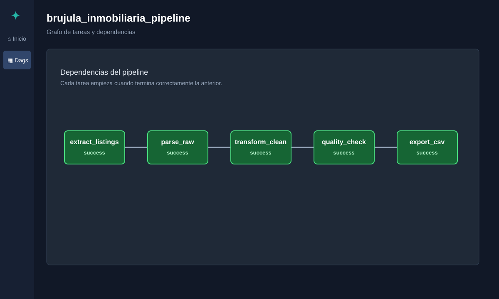
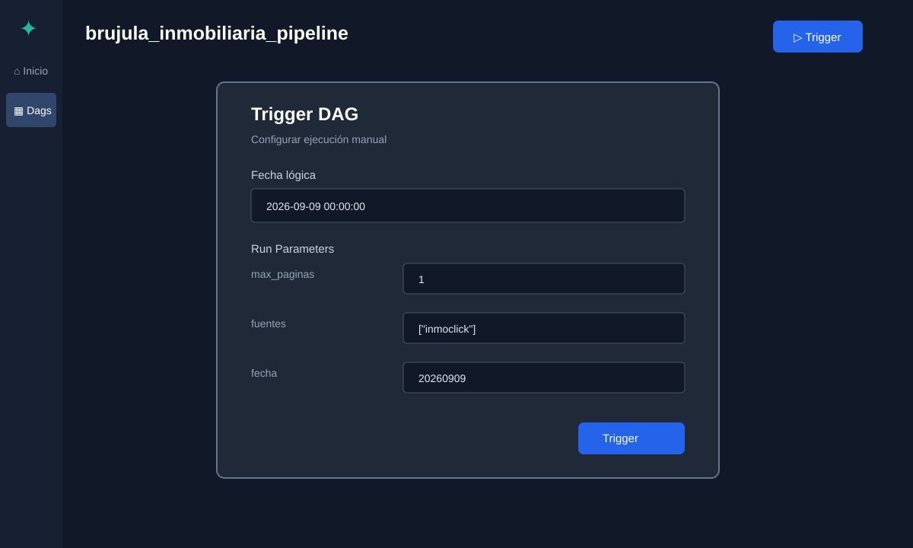
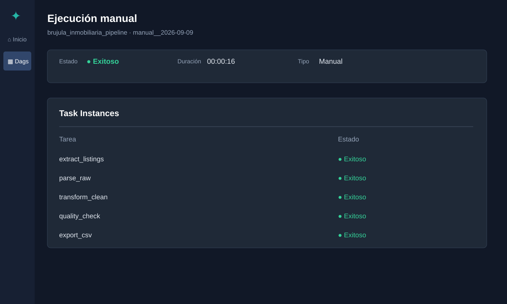
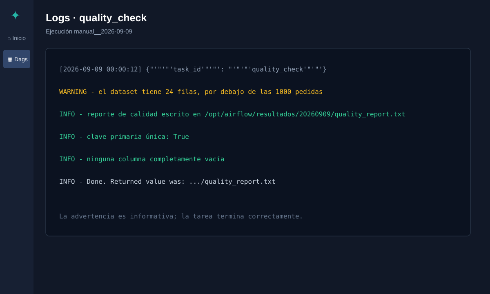

# Informe de uso de Airflow — Brujula Inmobiliaria

## 1. Resultado de la instalación

Se verificó el entorno de Airflow desde el navegador y desde Docker.

- Repositorio: Alquileres-Ciencia-de-Datos
- Rama: feature/pipeline-multifuente-inmoclick-inmoup
- Interfaz: http://localhost:8080
- Usuario local: airflow
- DAG: brujula_inmobiliaria_pipeline
- Fecha de verificación: 09/09/2026, hora local de Argentina
- Modo: ejecución manual; el DAG no tiene schedule automático

La API de salud respondió correctamente y los contenedores principales quedaron en estado healthy. La imagen del proyecto es brujula-airflow:3.3.0.

## 2. Qué es Airflow en este proyecto

Airflow es el coordinador del pipeline. No es el scraper por sí solo: ordena las partes del programa, espera las dependencias, registra el estado de cada tarea y muestra los logs desde el navegador.

El archivo dags/brujula_pipeline.py define el orden. La lógica real vive en dags/brujula/, para poder probarla también sin Airflow.

    extract_listings -> parse_raw -> transform_clean -> quality_check -> export_csv

La flecha significa que la tarea de la derecha empieza después de que la anterior terminó correctamente.

## 3. Qué hace cada contenedor

| Contenedor | Función |
|---|---|
| airflow-apiserver | Sirve la interfaz web y la API en el puerto 8080. |
| airflow-scheduler | Decide cuándo ejecutar tareas y respeta las dependencias. |
| airflow-dag-processor | Lee los archivos Python de dags/ y registra los DAGs. |
| airflow-worker | Ejecuta el código real de las tareas. |
| airflow-triggerer | Atiende tareas diferibles o que esperan eventos. |
| postgres | Guarda metadata: usuarios, ejecuciones, estados y configuración. |
| redis | Cola de mensajes entre scheduler y worker. |
| airflow-init | Inicializa la base y el usuario; termina con código 0. |

Por eso airflow-init no queda corriendo: es normal que termine exitosamente.

## 4. Cómo iniciar y detener Airflow

Abrir PowerShell y ejecutar:

    cd "C:\Users\varga\Desktop\Ciencia de Datos\Integrador\Alquileres-Ciencia-de-Datos"
    docker compose up -d

Comprobar el estado:

    docker compose ps

Abrir el navegador en:

    http://localhost:8080

Credenciales locales:

    Usuario: airflow
    Contraseña: airflow

Para detener sin borrar la metadata:

    docker compose down

Para levantarlo otra vez:

    docker compose up -d

No usar docker compose down --volumes como rutina: borra los volúmenes de Docker, incluida la metadata de Airflow.

Si se clona el repo en otra máquina, descargar una vez el compose oficial y preparar el entorno:

    cd "C:\ruta\al\repo\Alquileres-Ciencia-de-Datos"
    Invoke-WebRequest -Uri "https://airflow.apache.org/docs/apache-airflow/3.3.0/docker-compose.yaml" -OutFile "docker-compose.yaml"
    Copy-Item .env.example .env
    docker compose build
    docker compose up airflow-init
    docker compose up -d

El Dockerfile instala las librerías de requirements.txt durante el build, para no reinstalarlas en cada arranque.

## 5. Recorrido de la interfaz

### 5.1 Panel inicial

El inicio muestra:

- DAGs fallidos: DAGs cuya última ejecución falló.
- DAGs en ejecución: ejecuciones activas en este momento.
- DAGs activos: DAGs habilitados.
- Salud: estado de base de metadata, scheduler, triggerer y procesador de DAGs.
- Historial: resumen de ejecuciones y tareas.

En el recorrido, los cuatro indicadores de salud se mostraron verdes.

Captura 1 — Panel inicial. Se tomó durante la sesión y muestra la salud de los componentes y el DAG activo.

### 5.2 Lista de DAGs

En el menú lateral elegir Dags. El proyecto tiene un DAG:

    brujula_inmobiliaria_pipeline

El interruptor de la tarjeta debe estar activo. Si está pausado, el DAG puede verse, pero no se ejecutará cuando se lo dispare.

La tarjeta muestra también la última ejecución. El color significa:

- verde: terminó correctamente;
- rojo: falló;
- estados intermedios: en cola o ejecutándose.

Captura 2 — Lista de DAGs. Se ve el DAG activo, las etiquetas brujula-inmobiliaria y entrega-1, y la última ejecución.

### 5.3 Vista del DAG

Al abrir el DAG aparece el grafo de cinco tareas:

1. extract_listings
2. parse_raw
3. transform_clean
4. quality_check
5. export_csv

Esta vista permite ubicar rápidamente dónde se detuvo una ejecución.

Captura 3 — Grafo del pipeline. El color de cada tarea indica su estado.

### 5.4 Botón Trigger

El botón Trigger abre el formulario de una ejecución manual. Abrir el formulario no ejecuta nada; la ejecución empieza al confirmar el botón Trigger dentro del formulario.

El formulario tiene:

- Fecha lógica: fecha y hora con las que Airflow identifica la ejecución. Sirve para ordenar el historial.
- Run Parameters: parámetros que consume el código del proyecto.

Los parámetros son:

| Campo | Qué hace | Ejemplo de prueba |
|---|---|---|
| max_paginas | Limita cuántas unidades de búsqueda se recorren por fuente. | 1 |
| fuentes | Selecciona portales. | ["inmoclick"] |
| fecha | Elige la carpeta bronce AAAAMMDD. | 20260909 |

La fecha lógica no es lo mismo que fecha: la primera pertenece al historial de Airflow; la segunda elige datos guardados en data/raw/.

Captura 4 — Formulario de parámetros. Se tomaron los tres campos antes de confirmar una corrida.

## 6. Cómo hacer la primera ejecución

Para aprender y comprobar la instalación, conviene hacer una prueba corta:

    max_paginas: 1
    fuentes: ["inmoclick"]
    fecha: 20260909

Desde PowerShell, la misma prueba es:

    docker compose exec airflow-scheduler airflow dags trigger --conf '{"max_paginas":1,"fuentes":["inmoclick"],"fecha":"20260909"}' brujula_inmobiliaria_pipeline

Para usar InmoUP:

    docker compose exec airflow-scheduler airflow dags trigger --conf '{"max_paginas":1,"fuentes":["inmoup"],"fecha":"20260909"}' brujula_inmobiliaria_pipeline

Para una corrida completa de las dos fuentes:

    docker compose exec airflow-scheduler airflow dags trigger --conf '{"max_paginas":null,"fuentes":null,"fecha":null}' brujula_inmobiliaria_pipeline

La corrida completa puede tardar cerca de una hora la primera vez. Empieza siempre con max_paginas = 1.

## 7. Qué hace cada tarea

### extract_listings — capa bronce

Descarga listados y fichas de Inmoclick y/o InmoUP. Guarda el HTML sin modificar en:

    data/raw/AAAAMMDD/<fuente>/

Conservar el HTML permite corregir la transformación y reprocesar sin volver a scrapear. La extracción respeta robots.txt, usa un User-Agent propio y espera entre pedidos.

### parse_raw — interpretación

Lee el HTML guardado y arma un registro común por aviso.

- Inmoclick se interpreta desde la información de sus fichas y listados.
- InmoUP se interpreta desde su bloque JSON-LD.

Escribe:

    data/processed/_registros.json

Las tareas se pasan la ruta del archivo, no miles de registros por XCom, porque esos registros pueden ocupar varios megabytes.

### transform_clean — tipado y enriquecimiento

Convierte columnas a tipos útiles, arma la clave primaria y calcula variables:

- clave = fuente:usr_id-prp_id;
- precio_m2 = precio dividido por superficie cubierta;
- posible_duplicado_cruzado;
- motivo_sospecha.

Guarda un intermedio en data/processed/.

### quality_check — control de calidad

Ejecuta seis controles:

1. clave primaria única;
2. cantidad de filas;
3. forma del dataset;
4. mezcla de tipos;
5. proporción de nulos;
6. columnas 100% nulas.

Escribe:

    resultados/AAAAMMDD/quality_report.txt

Una advertencia no necesariamente hace fallar la tarea. Una prueba de 24 filas puede terminar bien y, al mismo tiempo, avisar que está por debajo de las 1.000 filas objetivo.

### export_csv — entrega

Escribe el CSV final:

    resultados/AAAAMMDD/brujula_inmobiliaria_alquiler_mendoza.csv

El CSV es el entregable que se abre con Excel, pandas u otra herramienta.

## 8. Dónde queda cada cosa

    data/raw/AAAAMMDD/<fuente>/       HTML crudo, capa bronce
    data/processed/                   JSON y CSV intermedios
    resultados/AAAAMMDD/              CSV final y reporte
    logs/                             logs montados de Airflow

Docker monta data/ y resultados/ dentro de los contenedores. Por eso el worker escribe también en las carpetas visibles del repositorio de Windows.

## 9. Resultados comprobados

### Corrida completa: resultados/20260908/

El reporte existente indica:

- 1.673 filas;
- 39 columnas;
- clave única: True;
- 969 avisos de InmoUP;
- 704 avisos de Inmoclick;
- 189 posibles duplicados entre portales, sin borrar;
- 40 valores sospechosos marcados;
- 68 filas sin precio_m2;
- ninguna columna completamente vacía.

### Prueba corta: resultados/20260909/

La prueba corta tiene:

- 24 filas;
- 36 columnas;
- solo Inmoclick;
- clave única: True;
- 0 valores sospechosos;
- 0 duplicados cruzados;
- una advertencia porque no supera las 1.000 filas objetivo.

### Ejecución manual exitosa

La interfaz verificó una ejecución manual de aproximadamente 16 segundos con todas las tareas en verde:

    extract_listings  Exitoso
    parse_raw         Exitoso
    transform_clean   Exitoso
    quality_check     Exitoso
    export_csv        Exitoso

Captura 5 — Detalle de la ejecución exitosa. Muestra el tipo Manual, usuario, duración y las cinco instancias exitosas.

## 10. Cómo leer los logs

Desde la interfaz:

1. abrir el DAG;
2. abrir una ejecución;
3. hacer clic en una tarea;
4. elegir Logs.

En quality_check de la prueba corta apareció:

    WARNING - el dataset tiene 24 filas, por debajo de las 1000 pedidas
    INFO - reporte de calidad escrito en /opt/airflow/resultados/20260909/quality_report.txt
    INFO - Done. Returned value was: .../quality_report.txt

La primera línea es una advertencia; las dos siguientes confirman que el reporte se escribió y que la tarea terminó.

Desde PowerShell:

    docker compose logs -f airflow-worker

Captura 6 — Logs de quality_check. Permite reconocer una advertencia sin confundirla con un error.

## 11. Por qué aparece una ejecución roja histórica

En el historial quedó smoke_20260909, una primera prueba que falló en quality_check por un caso de borde: en un dataset muy corto podía no existir una columna opcional después de la transformación.

Se corrigió dags/brujula/quality.py para manejar esa situación. Luego smoke_20260909_v2 y la ejecución manual posterior terminaron correctamente.

Por eso el resumen puede mostrar una tarea fallida histórica aunque la última ejecución esté en verde: Airflow conserva el historial.

## 12. Diagnóstico rápido

Si no abre localhost:8080:

    docker compose ps
    docker compose up -d

Si el DAG no aparece:

    docker compose exec airflow-scheduler airflow dags list-import-errors

Si está pausado:

    docker compose exec airflow-scheduler airflow dags unpause brujula_inmobiliaria_pipeline

Si cambió requirements.txt o Dockerfile:

    docker compose build
    docker compose up -d

Si se quiere reprocesar sin volver a scrapear, pasar fecha con una carpeta existente, por ejemplo 20260908.

## 13. Resumen

Para usar el proyecto:

1. levantar Docker;
2. abrir http://localhost:8080;
3. entrar con airflow / airflow;
4. ir a Dags;
5. abrir brujula_inmobiliaria_pipeline;
6. presionar Trigger;
7. empezar con max_paginas = 1;
8. revisar que las cinco tareas queden verdes;
9. abrir el CSV y quality_report.txt en resultados/AAAAMMDD/.

Las imágenes de las capturas 1 a 6 están incrustadas arriba con rutas relativas. Sus archivos fuente quedan en `Documentacion/capturas_airflow/`, por lo que también se ven al abrir este Markdown desde el repositorio.
